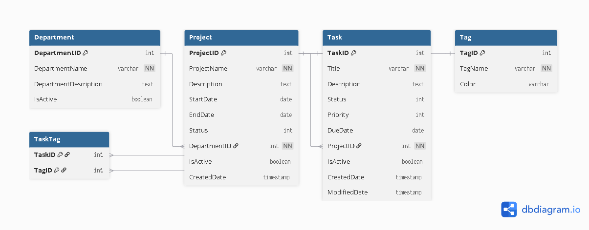

# TaskTrack Backend

TaskTrack is a Task & Team Management application developed for **PRN232 – Assignment 1**.

This repository contains the backend REST API built with **ASP.NET Core Web API (.NET 8)**, **Entity Framework Core Database-First**, and **PostgreSQL**.

## Student Information

- **Student ID:** QE190088
- **Class:** SE19B
- **Subject:** PRN232
- **Assignment:** Assignment 1

---

## Tech Stack

- ASP.NET Core Web API (.NET 8)
- Entity Framework Core
- PostgreSQL
- Npgsql.EntityFrameworkCore.PostgreSQL
- Swagger / OpenAPI
- Docker
- Render

---

## Architecture

The backend follows a layered architecture:

```text
Controller
    ↓
Service
    ↓
Repository
    ↓
Entity Framework Core
    ↓
PostgreSQL
```

Solution projects:

```text
TaskTrack.API
TaskTrack.Service
TaskTrack.Repo
```

### TaskTrack.API

Contains:

- Controllers
- Program.cs
- Swagger configuration
- CORS configuration
- Dependency Injection configuration

### TaskTrack.Service

Contains:

- Service interfaces
- Service implementations
- Business logic
- Validation rules

### TaskTrack.Repo

Contains:

- EF Core entities
- DbContext
- Repository interfaces
- Repository implementations

---

## Database

The application uses **PostgreSQL**.

The database schema is initialized using:

```text
TaskManagementDB_Postgres.sql
```

EF Core **Database-First** is used to map the existing PostgreSQL database.

Main tables:

- Department
- Project
- Task
- Tag
- TaskTag

---

## ERD

> Export the ERD from dbdiagram.io as `tasktrack-erd.png` and place it in `docs/tasktrack-erd.png`.



### Relationships

```text
Department 1 ─── N Project
Project    1 ─── N Task
Task       N ─── N Tag
                 │
              TaskTag
```

- One Department can contain many Projects.
- One Project belongs to one Department.
- One Project can contain many Tasks.
- One Task belongs to one Project.
- Tasks and Tags have a many-to-many relationship through TaskTag.

---

## Business Rules

### Department

- Only active departments are returned in active lists.
- A department cannot be deleted if it contains projects.

### Project

- Only active projects are returned in active lists.
- A project cannot be deleted if it contains tasks.

Project status values:

| Value | Status |
|---:|---|
| 0 | Not Started |
| 1 | In Progress |
| 2 | Completed |
| 3 | On Hold |

### Task

Task deletion uses **soft delete**:

```text
IsActive = false
```

Tasks are not physically removed from the database when deleted through the application.

Task status values:

| Value | Status |
|---:|---|
| 0 | To Do |
| 1 | In Progress |
| 2 | Done |
| 3 | Cancelled |

Task priority values:

| Value | Priority |
|---:|---|
| 0 | Low |
| 1 | Medium |
| 2 | High |
| 3 | Critical |

When a task is updated:

- `ModifiedDate` is updated.
- Existing TaskTag relationships are replaced with the selected tags.

### Tag

- A tag cannot be deleted while it is being used by a task.

---

## API Endpoints

### Departments

```http
GET    /api/departments
GET    /api/departments/{id}
GET    /api/departments/search?name=
POST   /api/departments
PUT    /api/departments/{id}
DELETE /api/departments/{id}
```

### Projects

```http
GET    /api/projects
GET    /api/projects/{id}
GET    /api/projects/department/{departmentId}
GET    /api/projects/search?name=&status=&departmentId=
POST   /api/projects
PUT    /api/projects/{id}
DELETE /api/projects/{id}
```

### Tasks

```http
GET    /api/tasks
GET    /api/tasks/{id}
GET    /api/tasks/project/{projectId}
GET    /api/tasks/search?title=&status=&priority=&projectId=&tagId=
POST   /api/tasks
PUT    /api/tasks/{id}
DELETE /api/tasks/{id}
```

### Tags

```http
GET    /api/tags
POST   /api/tags
PUT    /api/tags/{id}
DELETE /api/tags/{id}
```

---

## Environment Variables

Production configuration uses environment variables such as:

```env
DATABASE_URL=
FRONTEND_URL=
ASPNETCORE_ENVIRONMENT=Production
```

Do not commit real database passwords or private credentials.

---

## Run Locally

### Requirements

- .NET 8 SDK
- PostgreSQL

### Restore dependencies

```bash
dotnet restore
```

### Build

```bash
dotnet build
```

### Run API

```bash
dotnet run --project TaskTrack.API
```

---

## Deployment

### Backend

Hosted on Render:

https://tasktrack-api-mi6g.onrender.com

### Frontend

Hosted on Vercel:

https://prn-232-ass1-fe.vercel.app

### Database

PostgreSQL is hosted on Render.

---

## Repositories

- **Backend:** https://github.com/nhngchau/PRN232_Ass1_BE
- **Frontend:** https://github.com/nhngchau/PRN232_Ass1_FE

---

## Validation and Error Handling

The API uses standard HTTP responses such as:

```text
200 OK
201 Created
204 No Content
400 Bad Request
404 Not Found
500 Internal Server Error
```

Validation and delete-guard failures return meaningful error responses to the frontend.

---

## Main Features

- Public CRUD without authentication
- Department management
- Project management
- Task management
- Tag management
- Search and filtering
- Task soft delete
- Tag assignment
- Delete guards
- PostgreSQL database
- EF Core Database-First
- Swagger / OpenAPI
- CORS configuration
- Docker deployment
- Render deployment

---

## Known Issues

No known critical issues at the time of submission.

The Render free service may require a short cold-start period after being inactive.

---

## License

This project was created for educational purposes as part of **PRN232 Assignment 1** at FPT University.
